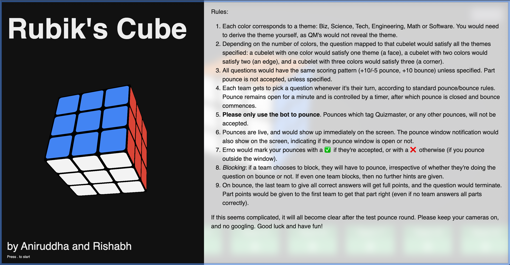
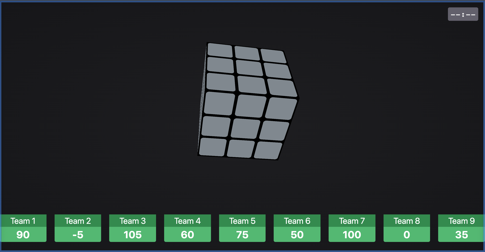

# Rubiks' Cube

A quiz player with an integrated discord pounce bot




### Instructions to run:

- Install the requirements
- setup your .env with the following template:
```
FLASK_APP='rubikscube'
FLASK_ENV='development'
SECRET_KEY='x'
BOT_TOKEN='xx'
NUM_TEAMS='n'
QUESTION_FILE='rubikscube/questions.md'
```
- Install ErnoBot (https://github.com/Aniruddha-Deb/ErnoBot)
- Run RubiksCube: `python -m rubikscube`
- Run ErnoBot: `python bot.py`
- Init teams on your server with `qtc`
- load `locahost:5000/index.html`
- have fun!
